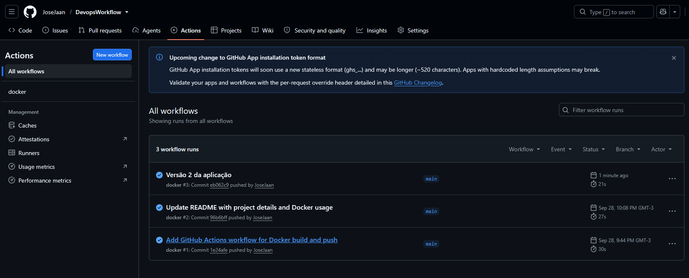

# DevopsWorkflow

## Parte 1

API em Python/FastAPI com o endpoint `GET /hello`, que retorna `Hello World`.
A aplicação é empacotada em uma imagem Docker (`python:3.12-slim` + uvicorn na porta 8000).

Build e execução local: `docker build -t luskation:1.0 .` e `docker run -p 8080:8000 luskation:1.0` (acesse `http://localhost:8080/hello`).
A cada push na `main`, o GitHub Actions faz o build da imagem, verifica se ela foi criada e publica no Docker Hub como `joseaaneto/luskation:<VERSION>`.
As credenciais ficam nos secrets `DOCKERHUB_USERNAME` e `DOCKERHUB_TOKEN`, nunca no arquivo da pipeline.

## Parte 2

O endpoint passou a retornar `Hello World 2` e a variável `VERSION` da pipeline foi para `2.0`.
O push na `main` dispara a pipeline de novo, que publica `joseaaneto/luskation:2.0`.

## Evidências

* Imagem no registry: https://hub.docker.com/r/joseaaneto/luskation/tags
* Execuções da pipeline: https://github.com/JoseJaan/DevopsWorkflow/actions

### Versão 1.0 baixada do registry

```
$ docker pull joseaaneto/luskation:1.0
Digest: sha256:f4b33eb483ae1519aedcc282e8ba37bf5f542b28a75780cf52cede3e0d7cfd25
Status: Downloaded newer image for joseaaneto/luskation:1.0
docker.io/joseaaneto/luskation:1.0
$ docker run -d -p 8080:8000 joseaaneto/luskation:1.0
$ curl http://localhost:8080/hello
Hello World
```

### Versão 2.0, build local antes da pipeline

```
$ docker build -t luskation:2.0 .
$ docker run -d -p 8080:8000 luskation:2.0
$ curl http://localhost:8080/hello
Hello World 2
```

### Versão 2.0 baixada do registry

```
$ docker pull joseaaneto/luskation:2.0
Digest: sha256:c33fc1e9984a249e46473172d3033ea474987be29cfa965cf533338e947ee7ef
Status: Downloaded newer image for joseaaneto/luskation:2.0
docker.io/joseaaneto/luskation:2.0
$ docker run -d -p 8080:8000 joseaaneto/luskation:2.0
$ curl http://localhost:8080/hello
Hello World 2
```

### Tags no registry

```
$ curl -s https://hub.docker.com/v2/repositories/joseaaneto/luskation/tags
2.0  2026-10-04T19:59:01Z
1.0  2026-09-29T01:08:35Z
```

### Execuções da pipeline

O push do commit "Versão 2 da aplicação" disparou a execução #3, concluída com sucesso em 21 s.


